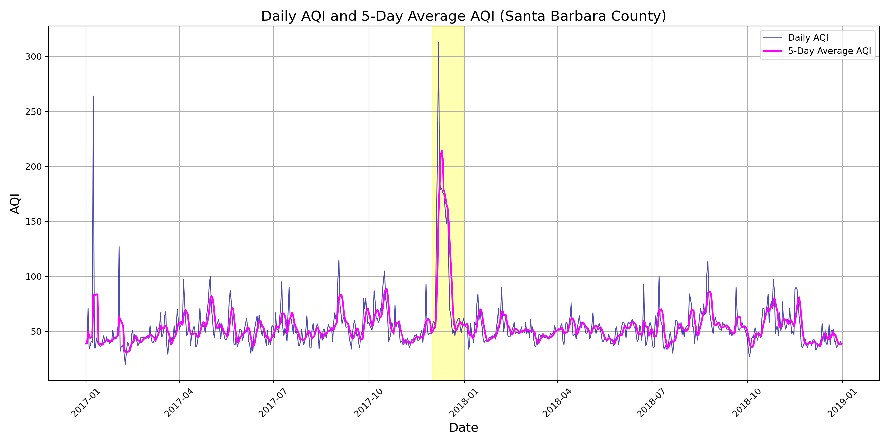

# Welcome to my Blogs

Welcome to my blog! Below, you'll find a list of my recent blog posts. Click on any image to read the full post and learn how that image was created with code.

[](False-color-blog-Ramirez.qmd)

---

```{r, echo=FALSE, results='asis'}
# List .qmd files in the 'posts' directory
blog_posts <- list.files(pattern = "*.qmd", full.names = TRUE)

# Filter out the current blog landing page file (e.g., blog.qmd)
blog_posts <- blog_posts[!grepl("Blog.qmd", blog_posts)]

# Extract titles from the first header (#) in each blog post
blog_titles <- sapply(blog_posts, function(x) {
  lines <- readLines(x)
  title <- gsub("^#\\s*", "", lines[1])  # Remove markdown header syntax (#)
  return(title)
})

# Create links to each post with ".html" extension (Quarto generates HTML files from .qmd)
links <- paste0("[", blog_titles, "](./", gsub(".qmd$", ".html", basename(blog_posts)), ")")

# Print the links as raw HTML
cat(links, sep = "<br>")
```

