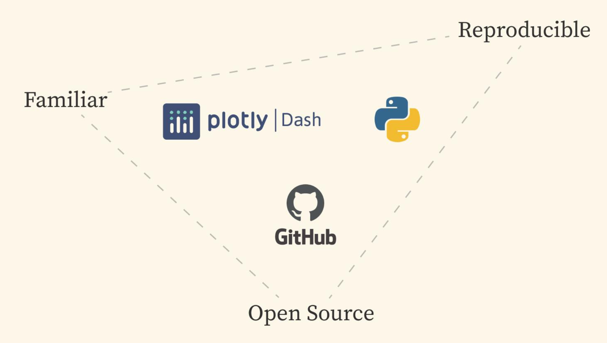
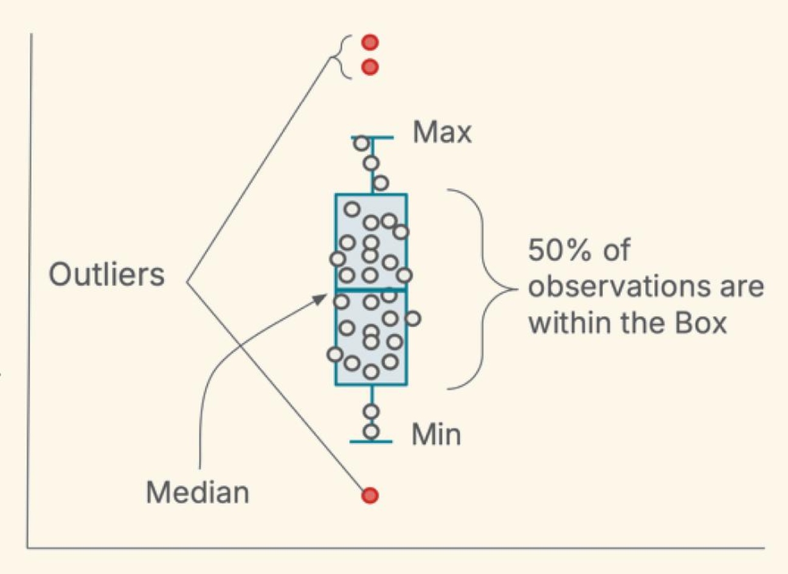
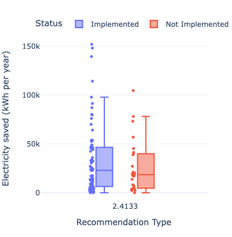
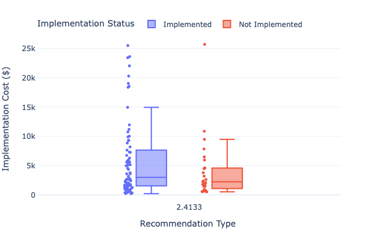
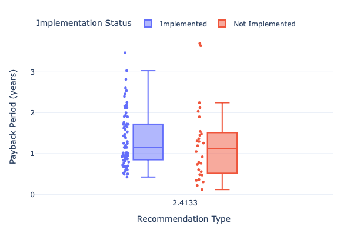
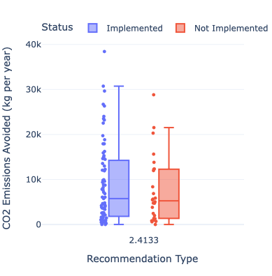

```{=html}
<style>
  /* Make all headers use the 'Arial' font */
  h1, h2, h3, h4, h5, h6 {
    font-family: 'Arial', serif;
  }
</style>
```

<h1 style="font-family: &#39;Arial&#39;;font-size: 30px;">

<center>[Building the Industrial Energy Efficiency Data Explorer]{style="color:teal"}</center>

</h1>

<h1 style="font-family: &#39;Lucida Console&#39;;font-size: 18px;">

::: {style="width: 300px; border-left: 1px solid #f9f9f9; background-color: #f9f9f9; padding: 0.75em; margin: 1em 0;"}
**Capstone Team**

Eva Newby\
Oksana Protskha\
Naomi Moraes\
Yos Ramirez
:::

</h1>

```{=html}
<style>
  body {
    font-family: 'Lucida Console', serif;
  }
</style>
```


<h1 style="font-size: 16px;">

<center>Reflection</center>

</h1>

Each team member will write their own

# Introduction

Industrial energy use sits at the heart of a big challenge powering the modern world without overheating the planet.

While factories are at the core of our modern lifestyle, producing, for example the clothes we wear, the food we eat, the bikes we ride, they also account for about 30% of U.S. greenhouse gas emissions.<sup>1</sup> Our capstone team set out to support the people working to address that challenge:

Industrial energy analysts and modelers.

Our project, advised by **Dr. Eric Masanet** at UCSB's Bren School of Environmental Science & Management and in partnership with the **Industrial Sustainability Analysis Lab**, designed and created a tool to make data-driven policy and technology analysis simpler, faster, and more reproducible. **The Industrial Energy Efficiency Data Explorer**.

------------------------------------------------------------------------

<h1 style="font-size: 20px;">

<center>Why Industrial Efficiency Matters</center>

</h1>

Manufacturing is a double-edged sword. On one hand, it's essential to our quality of life and economic vitality. On the other, it’s an enormous energy consumer and polluter. Take a closer look:

-   Industrial activity emits carbon dioxide (CO₂), nitrogen oxides (NOₓ), and sulfur dioxide (SO₂).

-   These emissions impact climate, public health, and air quality.

The good news? Analysts, researchers, and policy experts are actively working to improve efficiency and reduce emissions by building models that assess how manufacturing uses energy and where improvements can be made. For these experts to make progress, they need high-quality, accessible data and that’s where our project comes in.

### A Use Case

<h1 style="font-size: 16px;">

<center>Meet Erin</center>

</h1>

{width="800px"}

To ground the problem in a real-world context, let’s consider a user like Erin, an energy analyst working for the state of California. Erin’s role is to help policymakers understand how to improve energy efficiency in industrial plants. She’s just been asked to investigate the case for supporting motor efficiency upgrades in California’s food processing industry. This request was inspired by a paper showing these upgrades cut 187 million kg of CO₂ annually across the U.S., equivalent to the emissions from 44,000 cars driven in one year. <sup>2</sup>

Erin's boss wants to know:

1.  How much energy and emissions could be saved by applying this in California?

2.  What would it cost to implement?

3.  Should the state create an incentive program?

### The Challenge

<h1 style="font-size: 16px;">

<center>Fragmented, Manual Data Workflows</center>

</h1>

To answer these questions, Erin turns to the **Industrial Assessment Centers (IAC)** database the world’s largest dataset on industrial energy audits, with over 20,000 audits and 160,000 recommendations collected over 40+ years.<sup>3</sup> But there’s a problem:

-   The data lacks emissions factors.

-   Doesn’t account for changing electricity prices.

-   And must be manually cleaned, integrated, and analyzed mostly in Excel.

Each time new data is released, Erin has to redo this painstaking process from scratch.

------------------------------------------------------------------------

## Our Capstone Objective

<h1 style="font-size: 16px;">

<center>Our team set out to simplify and modernize this process</center>

</h1>

Given these challenges, our capstone project's objective was to build a user-friendly tool that enables energy analysts to quickly explore industrial energy efficiency data, draw insights, and inform decisions about decarbonization pathways.

<u>What We Delivered</u>

1.  An integrated dataset, combining audits, emissions, and economic data. <sup>4-10</sup>
2.  A data update pipeline, built for scalability and minimal manual effort.
3.  An interactive dashboard, so analysts like Erin can filter, visualize, and explore data instantly.

### Under the Hood

<h1 style="font-size: 16px;">

<center>How The Integrated Dataset Pipeline Works</center>

</h1>

Streamlined Process

We designed the integrated dataset update workflow to minimize time:

-   Data download remains manual (to avoid fragile automation).
-   From there, a single script handles cleaning, formatting, calculations, and merging.
-   Analysts can now update the full dataset in under 30 minutes, a dramatic improvement over manual processing.

<h1 style="font-size: 16px;">

<center>Dashboard Design</center>

</h1>

Built using Dash (Python) \[reference\], an open-source framework chosen for its long-term maintainability and alignment with our client’s tech stack. The dashboard is:

::: {style="display: flex; align-items: flex-start;"}


<p>

-   Easy to use
-   Tailored for energy modelers
-   Fully open-source and hosted on GitHub

</p>
:::

Through its development we worked closely with Dr. Masanet’s lab to identify the most useful filters and visualizations we decided on boxplots, which quickly reveal 3 things:

::: {style="display: flex; align-items: flex-start;"}


<p>

1.  Value ranges
2.  Patterns
3.  Outliers

</p>
:::

This allows analysts to move from questions to insights, without digging through spreadsheets.

------------------------------------------------------------------------

## A Real Example

<h1 style="font-size: 16px;">

<center>Erin Uses the Dashboard</center>

</h1>

Let’s revisit Erin’s motor replacement scenario. She can use the Industrial Energy Efficiency Data Explorer to filter for:

-   Location: CA\
-   ARC: Use Most Efficient Type of Electric Motors
-   Time Period: 1994–2024
-   Food Manufacturing

What the dashboard reveals:

::: {style="text-align: center;"}

:::

-   <i>Electricity Savings:</i>\
    Plants that implemented upgrades saved between 20,000 and 85,000 kWh/year.

::: {style="display: flex; justify-content: center; gap: 20px;"}
 
:::

-   <i>Investment & Payback:</i>\
    Implementers often faced higher upfront costs and longer payback periods but moved forward anyway, suggesting they saw long-term value.

::: {style="text-align: center;"}

:::

-   <i>Emissions Avoided:</i>\
    Each implementation avoided 2,500–14,000 kg of CO₂ annually (equivalent to driving 6,000–35,000 miles in a typical car).

    > *(Note: The boxplots shown in the dashboard include NOₓ and SO₂ estimates.)*

-   <i>Adoption Rates:</i>\
    Motor upgrades were implemented far more often than rejected, signaling that barriers to adoption are relatively low.

Erin’s analysis shows that these upgrades not only save energy but also deliver measurable climate benefits at relatively low cost. That’s a strong case for incentives.

From this analysis, Erin can confidently recommend exploring incentives for efficient motors in California. She has clear data on benefits, costs, and adoption trends.

------------------------------------------------------------------------

## Takeaway

<p>Building the Industrial Energy Efficiency Data Explorer has significantly simplified complex and fragmented data workflows, allowing analysts like Erin to quickly filter, visualize, and explore a large integrated dataset without manual data wrangling. The dashboard's intuitive design highlights key insights such as energy savings, investment payback periods, and emissions reductions, empowering users to make informed, data-driven decisions for industrial decarbonization. By integrating diverse datasets and providing interactive visualizations, this tool lays a strong foundation for accelerating energy efficiency improvements and shaping smarter policies.</p>

<h1 style="font-size: 16px;">

<center>What's next to consider</center>

</h1>

We see this dashboard as just the beginning. Future enhancements include:

-   Extending emissions coverage to pre-1990 data
-   Incorporating temporal and technology shift analysis
-   Moving from Excel to a database with API access

These upgrades would make the tool even more powerful and easier to scale for wider use across states and sectors.

------------------------------------------------------------------------

<h1 style="font-family: &#39;Arial&#39;;font-size: 24px;">

<center>[Acknowledgments]{style="color:#006666"}</center>

</h1>

We’re deeply grateful to:

-   **Dr. Eric Masanet** and the **Industrial Sustainability Analysis Lab**
-   **Dr. Carmen Galaz Garcia** and **Dr. Sandy Sum** for their mentorship and support

And of course, thank you to the many contributors who made the IAC dataset possible.

------------------------------------------------------------------------

### Explore the Project

Interested in exploring our code, dataset, or dashboard?\
👉 [**Visit the project GitHub repo**](https://github.com/IndustrialEnergy/dashboard) for the code.

👉 [**Visit the The Docker Container**](https://apps.bren.ucsb.edu/IE-Data/) for the data.

👉 [**Visit the Industrial Energy Efficiency Data Explorer**](https://industrialenergy.apps.bren.ucsb.edu/dashboard) for the dashboard. Together, we can make better tools for energy experts and attain lower electricity bills, cleaner air, and smarter policy for everyone.

<h1 style="font-size: 16px;">

<center>References</center>

</h1>

1.  U.S. Environmental Protection Agency. (n.d.). Industry Sector Emissions. Retrieved May 25, 2025, from https://www.epa.gov/ghgemissions/industry-sector-emissions

2.  U.S. Environmental Protection Agency. (2025, February 24). Greenhouse Gas Equivalencies Calculator. Retrieved May 25, 2025, from https://www.epa.gov/energy/greenhouse-gas-equivalencies-calculator

3.  Industrial Assessment Centers. (n.d.). Retrieved January 8, 2025, from https://iac.university/#database

4.  Industrial Assessment Center. (n.d.). IAC Download Data. Retrieved January 8, 2025, from https://iac.university/download

5.  U.S. Energy Information Administration. (n.d.). Annual electric power industry emissions data \[Data set\]. Retrieved February 4, 2025, from https://www.eia.gov/electricity/data/state/emission_annual.xlsx

6.  U.S. Energy Information Administration. (n.d.). Annual generation data by state. Retrieved February 4, 2025, from https://www.eia.gov/electricity/data/state/annual_generation_state.xls

7.  U.S. Environmental Protection Agency. (n.d.). AP-42, Compilation of air pollutant emissions factors from stationary sources. Retrieved February 4, 2025, from https://www.epa.gov/air-emissions-factors-and-quantification/ap-42-compilation-air-emissions-factors-stationary-sources

8.  U.S. Bureau of Labor Statistics. (n.d.). Producer Price Index (PPI). Retrieved February 4, 2025, from https://www.bls.gov/ppi/

9.  U.S. Census Bureau. (2022). 2022 NAICS codes listed numerically 2-digit through 6-digit \[Data set\]. Retrieved February 4, 2025, from https://www.naics.com/search/

10. U.S. Census Bureau. (2022). 2022 NAICS to SIC crosswalk \[Data set\]. Retrieved February 4, 2025, from https://www.naics.com/search/
